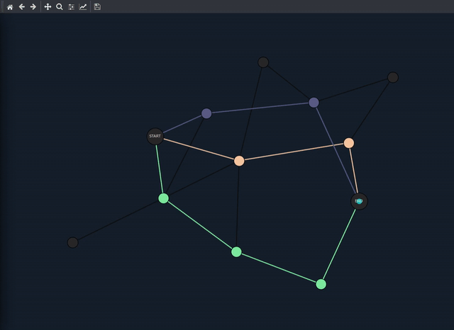
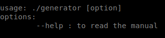
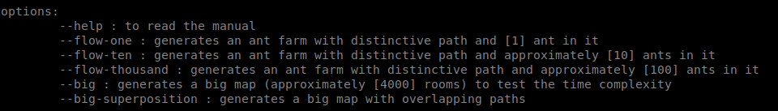
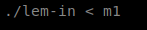
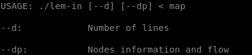

# lem-in
Your ant colony must move from one point to another. But how do you make it take as little time as possible?
This project introduces you to graph traversal algorithms: your program will have to intelligently select the precise paths and movements that must be taken by these ants.

generate a map

executing lem-in

